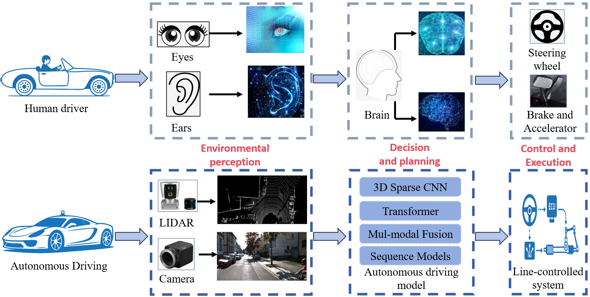
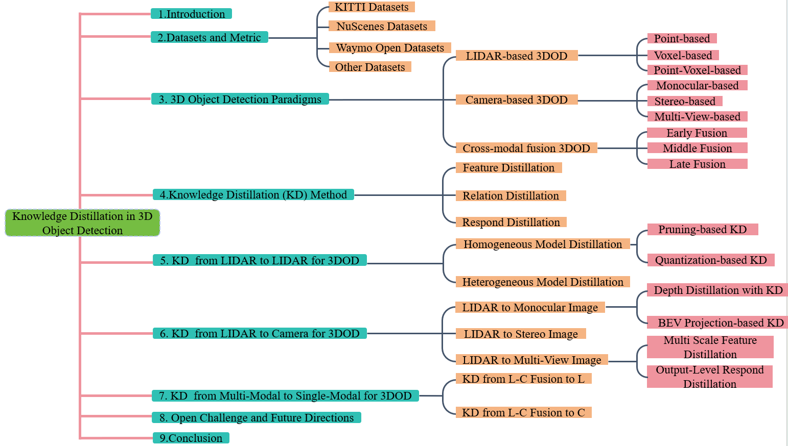
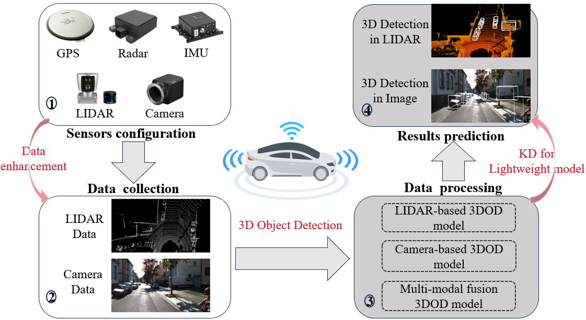
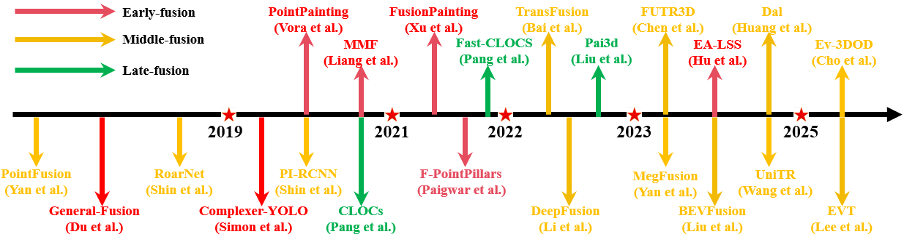
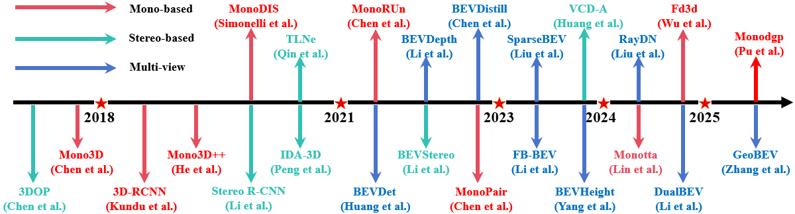
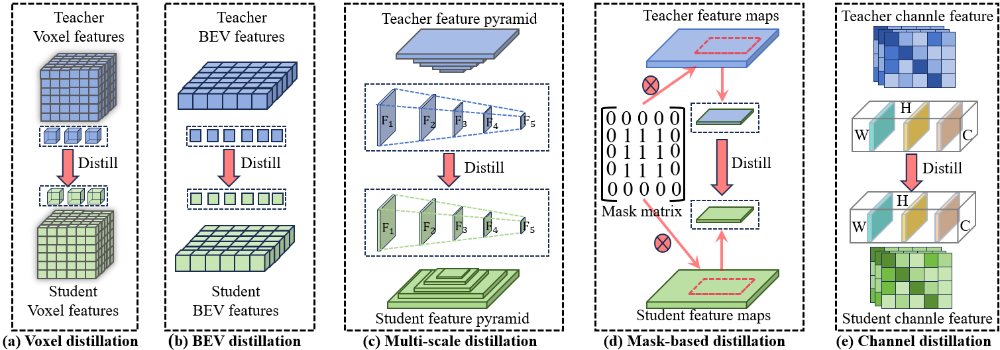
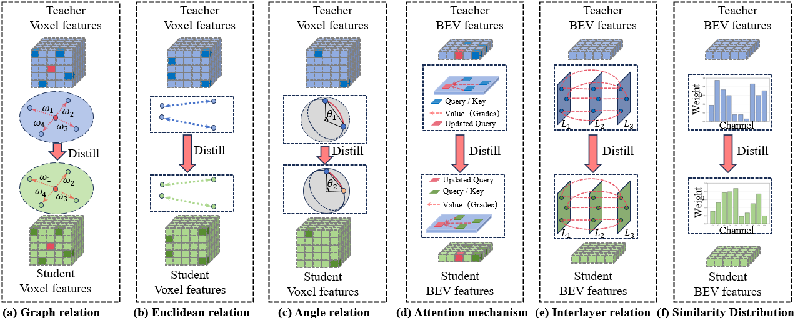
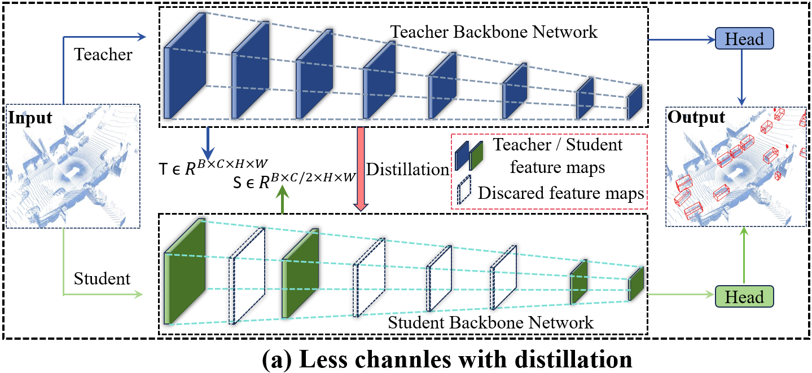
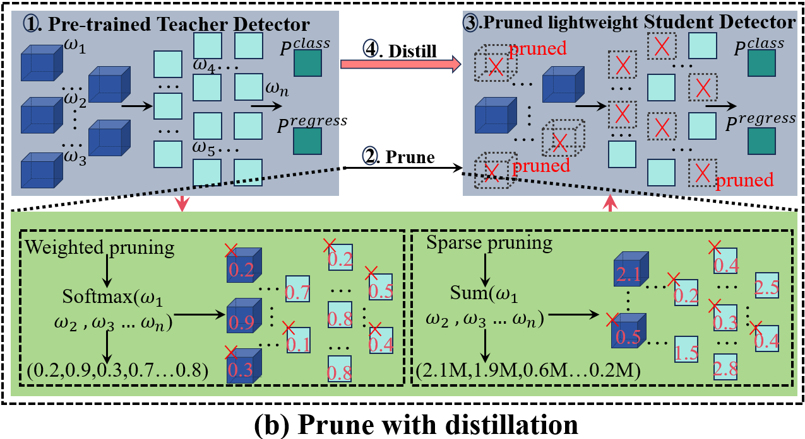
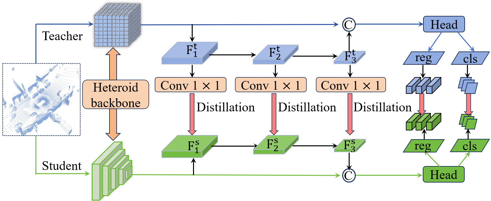

# A Comprehensive Review of Knowledge Distillation Methods for 3D Object detection in Autonomous Driving (2025)
 We are constantly updating this project page. If you have any questions, please contact us [here](mailto:bch88888@s.ytu.edu.cn).



This repository is with our [survey paper](https://arxiv.org/abs/2206.09474):

> **Title:** A Comprehensive Review of Knowledge Distillation Methods for 3D Object detection in Autonomous Driving <br>
> **Authors:** Changhong Bu,Weiqing Yan:<br>
> **Publication:** None <br>

We collect the most commonly used autonomous driving datasets at [Datasets for Autonomous Driving](Papers.md).  
the current 3D object detection methods at [3D Object Detection Methods -- LIDAR, Camera, LiDAR-Camera fusion](Papers.md).  
the knowledge distillation–based approaches for 3D object detection at [3D Object Detection Algorithm Based on Knowledge Distillation](Papers.md).

## Content



<a name="0"></a>

- [1. The Paradigm of 3D Object Detection](#1)
    - [1.1 LiDAR-based 3D Object Detection](#1.1)
        - [1.1.1 Point-based 3D object detection](#1.1.1)
        - [1.1.2 Voxel-based 3D object detection](#1.1.2)
        - [1.1.3 Point-voxel fusion based 3D object detection](#1.1.3)
    - [1.2 Camera-based 3D Object Detection](#1.2)
        - [1.2.1 Monocular 3D object detection](#1.2.1)
        - [1.2.2 Stereo-based 3D object detection](#1.2.2)
        - [1.2.3 Multi-view 3D object detection](#1.2.3)
    - [1.3 Multi-Modal 3D Object Detection](#1.3)
        - [1.3.1 Early-fusion based 3D object detection](#1.3.1)
        - [1.3.2 Middile-fusion based 3D object detection](#1.3.2)
        - [1.3.3 Late-fusion based 3D object detection](#1.3.3)
- [2. What is Knowledge Distillation (Feature distillation,Relation distillation,Respond distillation) ](#2)
    - [2.1 Feature distillation](#2.1)
    - [2.2 Relation distillation](#2.2)
    - [2.3 Respond distillation](#2.3)
- [3. LIDAR to LIDAR Knowledge Distillation for 3D Detection](#3)
    - [3.1 Homogeneous distillation](#3.1)
        - [3.1.1 Pruning with Distillation](#3.1)
        - [3.1.2 Quantification with Distillation](#3.2)
    - [3.2 Heterogeneous distillation](#3.2)
- [4. LIDAR to Camera Knowledge Distillation for 3D Detection](#4)
    - [4.1 LIDAR to monocular image for 3D object detection](#4.1)
    - [4.2 LIDAR to stereo image for 3D object detection](#4.2)
    - [4.3 LIDAR to multi-view image for 3D object detection](#4.3)
- [5. LIDAR-Based-Multi-Modal to other Modal Knowledge Distillation for 3D Detection ](#5)
    - [5.1 LIDAR-Camera Fusion to LIDAR](#5.1)
    - [5.2 LIDAR-Camera Fusion to Camera](#5.2)
  

# The Paradigm of 3D Object Detection


The pipeline of 3D object detection, ranging from heterogeneous sensor inputs and multimodal data processing to lightweight model optimization with knowledge distillation, and culminating in the final prediction stage.

## LiDAR-based 3D Object Detection
<a name="1"></a>


A chronological overview of the most influential LiDAR-based 3D object detection methods in Autonomous Driving.

### Point-based 3D object detection


Traditional point-based methods generally consist of three main stages: sampling, feature learning, and final prediction. The sampling stage aims to select representative subsets of points from raw point clouds, with commonly used strategies including farthest point sampling (FPS) ,
random sampling (RS) , density-based sampling (DS) ,and voxel-based sampling (VS). The sampled points are subsequently fed into a feature learning network—such as multi- layer perceptrons (MLPs) , transformers, or graph convolutional networks (Graph CNNs) [180]—to extract discriminative feature representations. Finally, a prediction head is employed to perform tasks such as 3D object detection and object localization.

<a name="1.1.1"></a>

### Voxel-based 3D object detection


Voxel-based 3D object detection methods provide a structured representation for feature extraction and bounding box prediction by discretizing unordered point clouds into regular 3D voxel grids. Two common types of voxel-based methods are voxel grid–based and pillar grid–based approaches. After voxelization, the encoded voxels are fed into feature learning networks for representation extraction, and the learned features are typically projected onto the bird’s-eye view (BEV)plane for final prediction.

<a name="1.1.2"></a>

### Point-voxel based 3D object detection


Hybrid point-voxel-based 3D object detection achieves significant performance improvements by leveraging the complementary properties of point clouds and voxels.

<a name="1.1.3"></a>

## Camera-based 3D Object Detection



A chronological overview of the most influential camera-based 3D object detection methods.

<a name="1.2"></a>

### Image-only monocular 3D object detection

<a name="1.2.1"></a>

### Stereo-based 3D object detection 

<a name="1.2.2"></a>

### Multi-view-based 3D object detection

<a name="1.2.3"></a>

## Multi-Modal 3D Object Detection


A chronological overview of the most influential LIDAR-Camera fusion methods for 3D object detection.

<a name="1.3"></a>

### Early fusion for 3D object detection
None
<a name="1.3.1"></a>

### Middle fusion for 3D object detection

None
<a name="1.3.2"></a>

### Late fusion for 3D object detection

None
<a name="1.3.3"></a>

# What is Knowledge Distillation?

Including characteristic distillation, relational distillation and response distillation

<a name="2"></a>

## Feature distillation


Feature distillation 

<a name="2.1"></a>

## Relation distillation


Relation distillation 
<a name="2.2"></a>

## Respond distillation


Respond distillation 

<a name="2.3"></a>

# LIDAR to LIDAR Knowledge Distillation for 3D Object Detection


Including Homogeneous distillation and Heterogeneous distillation.

<a name="3"></a>

## Homogeneous distillation 
<a name="3.1"></a>

### Less channels with distillation


Feature distillation 

<a name="3.1.1"></a>

### Pruning with Distillation


Relation distillation 
<a name="3.1.2"></a>

### Quantification with Distillation


Respond distillation 

<a name="3.1.3"></a>

## Heterogeneous distillation

<a name="3.2"></a>

### Quantification with Distillation


Respond distillation 

<a name="3.2"></a>

# LIDAR to Camera Knowledge Distillation for 3D Object Detection


<a name="4"></a>

## LIDAR to monocular image for 3D object detection 

None
<a name="4.1"></a>

## LIDAR to stereo image for 3D object detection 

None
<a name="4.2"></a>

## LIDAR to multi-view image for 3D object detection 

None
<a name="4.3"></a>


# LIDAR-Based-Multi-Modal to other Modal Knowledge Distillation for 3D Detection
None
<a name="5"></a>

## LIDAR-Camera Fusion to LIDAR

None
<a name="5.1"></a>

## LIDAR-Camera Fusion to Camera

None
<a name="5.2"></a>


## Acknowledgement

We express our gratitude to the following works, whose contributions greatly facilitate our research-- [Awesome 3D Object Detection for Autonomous Driving:A Comprehensive Survey](https://github.com/PointsCoder/Awesome-3D-Object-Detection-for-Autonomous-Driving) and [When Object Detection Meets Knowledge
Distillation:A Survey](https://ieeexplore.ieee.org/document/10070820) and [Multi-Modal 3D Object Detection in Autonomous Driving:A Survey](https://link.springer.com/article/10.1007/s11263-023-01784-z).

## Citation

If you find this project useful in your research, please consider cite:
```
@article{mao20233d,
  title={3D object detection for autonomous driving: A comprehensive survey},
  author={Mao, Jiageng and Shi, Shaoshuai and Wang, Xiaogang and Li, Hongsheng},
  journal={International Journal of Computer Vision},
  volume={131},
  number={8},
  pages={1909--1963},
  year={2023},
  publisher={Springer}
}
```
```


