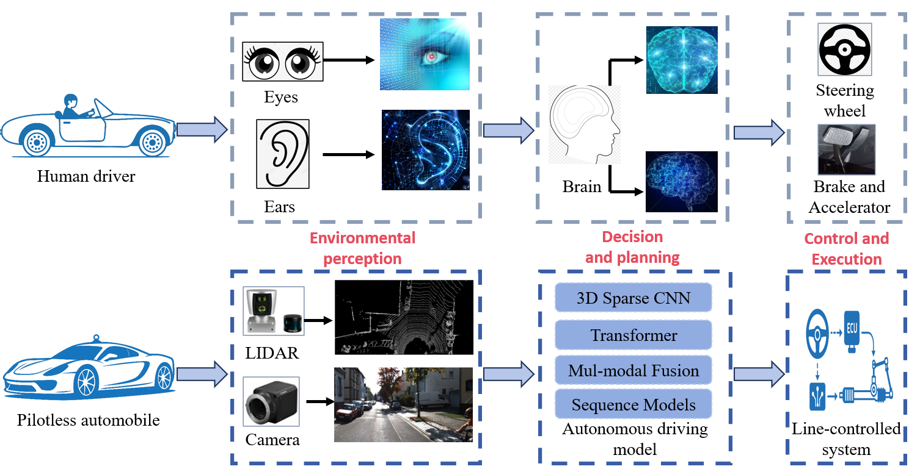

# 3D Object Detection for Autonomous Driving: A Comprehensive Survey (2025)

This repository is with our [survey paper](https://arxiv.org/abs/2206.09474):

> **Title:** 3D Object Detection for Autonomous Driving: A Comprehensive Survey  
> **Authors:** Changhong Bu, Weiqing Yan 
> arXiv preprint arXiv:2206.09474 
> **Publication:** None  

We also provide a paper collection on 3D object detection for autonomous driving at [Awesome 3D Object Detection for Autonomous Driving](Papers.md).

## Content

- [1. The Paradigm of 3D Object Detection](#1)
    - [1.1 LiDAR-based 3D Object Detection](#1.1)
        - [1.1.1 Point-based 3D object detection](#1.1.1)
        - [1.1.2 Grid-based 3D object detection](#1.1.2)
        - [1.1.3 Point-voxel based 3D object detection](#1.1.3)
    - [1.2 Camera-based 3D Object Detection](#1.2)
        - [1.2.1 Monocular 3D object detection](#1.2.1)
        - [1.2.2 Stereo-based 3D object detection](#1.2.2)
        - [1.2.3 Multi-view 3D object detection](#1.2.3)
    - [1.3 Multi-Modal 3D Object Detection](#1.3)
        - [1.3.1 Early-fusion based 3D object detection](#1.3.1)
        - [1.3.2 Intermediate-fusion based 3D object detection](#1.3.2)
        - [1.3.3 Late-fusion based 3D object detection](#1.3.3)
- [2. What is Knowledge Distillation (Feature distillation,Relation distillation,Respond distillation) ](#2)
    - [2.1 Feature distillation](#2.1)
    - [2.2 Relation distillation](#2.2)
    - [2.3 Respond distillation](#2.3)
- [3. LIDAR to LIDAR Knowledge Distillation for 3D Detection](#3)
    - [3.1 Less channels with distillation](#3.1)
    - [3.2 Pruning with Distillation](#3.2)
    - [3.3 Quantification with Distillation](#3.3)
- [4. LIDAR to Camera Knowledge Distillation for 3D Detection](#4)
    - [4.1 LIDAR to monocular image for 3D object detection](#4.1)
    - [4.2 LIDAR to stereo image for 3D object detection](#4.2)
    - [4.3 LIDAR to multi-view image for 3D object detection](#4.3)
- [5. LIDAR-Based-Multi-Modal to other Modal Knowledge Distillation for 3D Detection ](#5)
    - [5.1 LIDAR-Camera Fusion to LIDAR](#5.1)
    - [5.2 LIDAR-Camera Fusion to Camera](#5.2)
  

## The Paradigm of 3D Object Detection

This is the mainstream 3D object detection paradigm in 3D, mainly including three types. [[Back to content]](#0)

### Point-based 3D object detection [[Papers]](Docs/Sensor/LiDAR/point_view.md)

A chronological overview of the most prestigious LiDAR-based 3D object detection methods. [[Back to content]](#0)

A general point-based detection framework contains a point-based backbone network and a prediction head. The point-based backbone consists of several blocks for point cloud
sampling and feature learning, and the prediction head directly estimates 3D bounding boxes from the candidate points. [[Back to content]](#0)

### Grid-based 3D object detection [[Papers]](Docs/Sensor/LiDAR/volumetric_view.md)

The grid-based approaches rasterize point cloud into
3 grid representations: voxels, pillars, and bird’s-eye view (BEV) feature maps. 2D convolutional neural networks or 3D
sparse neural networks are applied on grids for feature extraction. 3D objects are finally predicted from BEV grid cells. [[Back to content]](#0)

### Point-voxel based 3D object detection [[Papers]](Docs/Sensor/LiDAR/mixed_views.md)

Single-stage point-voxel detection framework fuses
point and voxel features in the backbone network. Two-stage point-voxel detection framework first generates 3D object
proposals with a voxel-based 3D detector, and then refines these proposals using keypoints sampled from point cloud. [[Back to content]](#0)

## Camera-based 3D Object Detection

A chronological overview of the camera-based 3D object detection methods. [[Back to content]](#0)

### Image-only monocular 3D object detection [[Papers]](Docs/Sensor/Camera/monocular.md)

Single-stage anchor-based approaches
predict 3D object parameters leveraging both image features
and predefined 3D anchor boxes. Single-stage anchor-free
methods directly predict 3D object parameters from image
pixels. Two-stage approaches first generate 2D bounding
boxes from a 2D detector, and then lift up 2D detection to
the 3D space by predicting 3D object parameters from the
2D RoI features. [[Back to content]](#0)

### Depth-assisted monocular 3D object detection [[Papers]](Docs/Sensor/Camera/monocular.md)

Depth-image based approaches obtain
depth-aware image features by fusing information from both the RGB image and the depth image. Pseudo-LiDAR based
methods first transform the depth image into a 3D pseudo point cloud, and then apply LiDAR-based 3D detector on the
point cloud to detect 3D objects. Patch-based approaches transform the depth image into a 2D coordinate map, and then
apply a 2D neural network on the coordinate map for detection. [[Back to content]](#0)

### Prior-guided monocular 3D object detection [[Papers]](Docs/Sensor/Camera/monocular.md)

Prior-guided approaches leverage object shape priors, geometric priors, segmentation and temporal constrains to help detect 3D objects. [[Back to content]](#0)

### Stereo-based 3D object detection [[Papers]](Docs/Sensor/Camera/stereo.md)

2D-detection based methods first generate a pair of 2D
proposals from the left and right image respectively, and then estimate 3D object parameters from the paired proposals.
Pseudo-LiDAR based approaches predict a disparity map by stereo matching, and then transform the disparity estimation
into depth and 3D point cloud subsequently, followed by a LiDAR-based detector for 3D detection. Volume-based methods
construct a 3D feature volume by view transform, and then a grid-based 3D object detector is applied on the 3D volume
for detection. [[Back to content]](#0)

## Multi-Modal 3D Object Detection

A chronological overview of the most prestigious multi-modal 3D object detection methods. [[Back to content]](#0)

### Multi-modal detection with LiDAR-camera fusion (Early-Fusion) [[Papers]](Docs/Sensor/MultiModal/lidar_and_camera.md)

Early-fusion approaches enhance point cloud
features with image information before they are passed through a LiDAR-based 3D object detector. In region-level
knowledge fusion, 2D detection is firstly employed on images to generate 2D bounding boxes. Then 2D boxes are
extruded into viewing frustums to select proper point cloud regions for the subsequent LiDAR-based 3D object detection.
In point-level knowledge fusion, semantic segmentation is firstly applied on images, and then the segmentation results are
transferred from the image pixels to points and used as an additional feature attached to each point. The augmented point
cloud is finally passed through a LiDAR detector for 3D object detection. [[Back to content]](#0)

### Multi-modal detection with LiDAR-camera fusion (Intermediate-Fusion) [[Papers]](Docs/Sensor/MultiModal/lidar_and_camera.md)

Intermediate fusion approaches aim to
conduct multi-modal fusion at the intermediate steps of a 3D object detection pipeline. In backbone networks, pixel-to-point
correspondences are firstly established by camera-to-LiDAR transform, and then with the correspondences, LiDAR features
are fused with image features through diverse fusion operators. The fusion can be conducted either at the intermediate
layers or only at the output feature maps. In the proposal generation and refinement stage, 3D object proposals are first
generated and then projected into the camera and LiDAR views to crop features of different modalities. The multi-view
features are finally fused to refine the 3D object proposals for detection. [[Back to content]](#0)

### Multi-modal detection with LiDAR-camera fusion (Late-Fusion) [[Papers]](Docs/Sensor/MultiModal/lidar_and_camera.md)

Late-fusion based approaches operate on the
outputs, i.e. 3D and 2D bounding boxes, generated from a LiDAR-based 3D object detector and an image-based 2D object
detector respectively. 3D boxes and 2D boxes are combined together and fused to obtain the final detection results. [[Back to content]](#0)

## Temporal 3D Object Detection

A chronological overview of the most prestigious temporal 3D object detection methods. [[Back to content]](#0)

### 3D object detection from LiDAR sequences [[Papers]](Docs/Sequential/sequential.md)

In temporal 3D object detection from LiDAR sequences, diverse temporal aggregation modules
are employed to fuse features and object proposals from
multi-frame point clouds. [[Back to content]](#0)

### 3D object detection from streaming data [[Papers]](Docs/Sequential/sequential.md)

Detection from streaming data is conducted on each LiDAR
packet before the scanner produces a complete sweep. [[Back to content]](#0)

## Label-Efficient 3D Object Detection

### Domain adaptation for 3D object detection [[Papers]](Docs/Learning/domain_adaptation.md)

In real-world applications, 3D object detectors suffer from severe domain gaps across different datasets, sensors, and weather conditions. [[Back to content]](#0)

### Weakly-supervised 3D object detection [[Papers]](Docs/Learning/weak_learning.md)

Weakly-supervised approaches learn to
detect 3D objects with weak supervisory signals. [[Back to content]](#0)

### Semi-supervised 3D object detection [[Papers]](Docs/Learning/semi_learning.md)

Semi-supervised approaches first pretrain
a 3D detector on the labeled data, and then use the
pre-trained detector to produce pseudo labels or leverage
teacher-student models for training on the unlabeled data
to further boost the detection performance. [[Back to content]](#0)

### Self-supervised 3D object detection [[Papers]](Docs/Learning/self_learning.md)

Self-supervised approaches first pre-train
a 3D detector on the unlabeled data in a self-supervised
manner, and then fine-tune the detector on the labeled data. [[Back to content]](#0)

## 3D Object Detection in Driving Systems

### End-to-end learning for autonomous driving [[Papers]](Docs/Applications/system.md)

End-to-end autonomous driving aims to integrate all
tasks in autonomous driving, e.g. perception, prediction, planning, control, mapping, localization, into a unified framework
and learn these tasks in an end-to-end manner. [[Back to content]](#0)

### Collaborative 3D object detection [[Papers]](Docs/Applications/cooperative_perception.md)

In collaborative 3D object detection, different
vehicles can communicate with each other to obtain a more
reliable detection results. [[Back to content]](#0)
